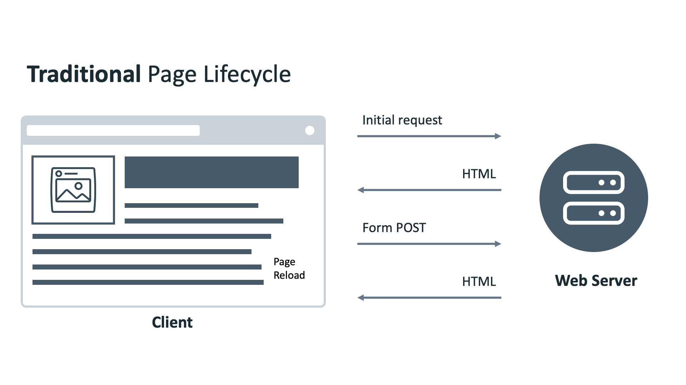
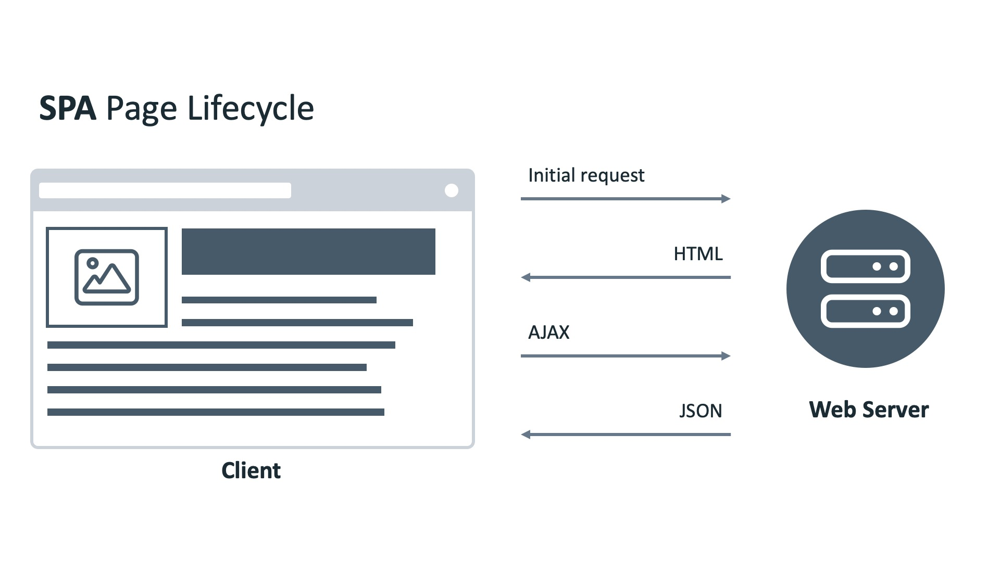
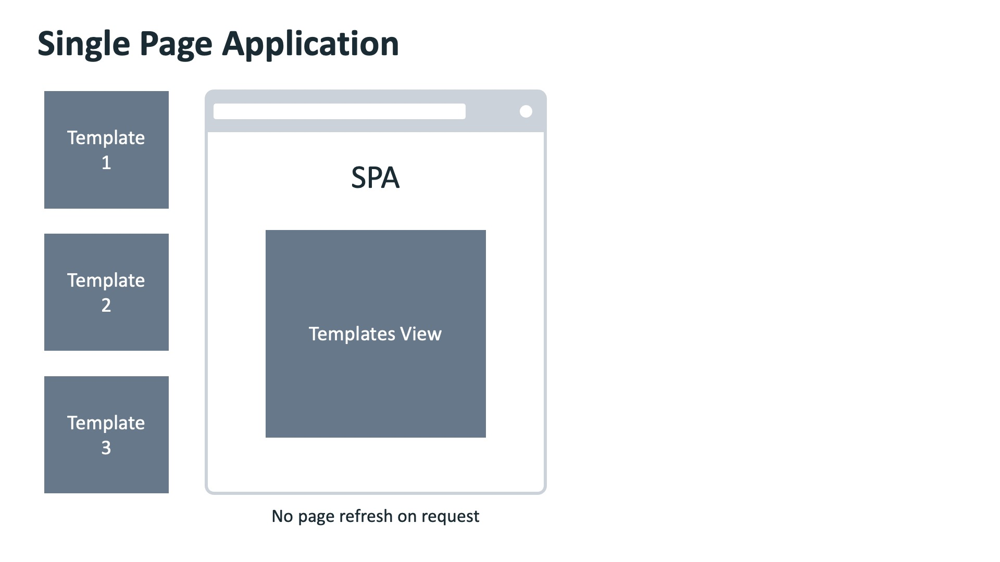
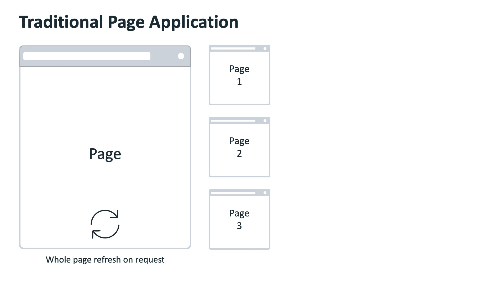

code for install React Router(for multi page feature):
```
npm i react-router-dom@6
```

following is the branch and dis
```
main - navigation
con-rend - Conditional rendering
```

# Bookmarks
1. [Navigation](#navigation)
2. [Applying conditional rendering](#applying-conditional-rendering)

# Navigation
In this reading, you’ll learn about the differences between traditional web pages and React-powered web pages (SPAs – single page applications).

Once you understand the difference between these two ways of building web pages, you will be able to understand the necessary difference between how navigation works in traditional web apps versus how it works in modern SPA websites.

## Before Single-Page Apps
Before the advent of modern JavaScript frameworks, most websites were implemented as multi-page applications. That is, when a user clicks on a link, the browser navigates to a new webpage, sends a request to the web server; this then responds with the full webpage and the new page is displayed in the browser.

This can make your application resource intensive to the Web Server. CPU time is spent rendering dynamic pages and network bandwidth is used sending entire webpages back for every request. If your website is complex, it may appear slow to your users, even slower if they have a slow or limited internet connection.

To solve this problem, many web developers develop their web applications as Single Page Applications.

## Single-Page Apps
You’re using many Single Page Applications every day. Think of your favorite social network, or online email provider, or the map application you use to find local businesses. Their excellent user experiences are driven by Single Page Applications.

A Single Page Application allows the user to interact with the website without downloading entire new webpages. Instead, it rewrites the current webpage as the user interacts with it. The outcome is that the application will feel faster and more responsive to the user.

## How Does a Single-Page App Work?
When the user navigates to the web application in the browser, the Web Server will return the necessary resources to run the application. There are two approaches to serving code and resources in Single Page Applications.

When the browser requests the application, return and load all necessary HTML, CSS and JavaScript immediately. This is known as bundling. 

1. When the browser requests the application, return only the minimum HTML, CSS and JavaScript needed to load the application. Additional resources are downloaded as required by the application, for example, when a user navigates to a specific section of the application. This is known as lazy loading or code splitting. 

2. Both approaches are valid and are used depending on the size, complexity and bandwidth requirements of the application. If your application is complex and has a lot of resources, your bundles will grow quite large and take a long time to download – possibly ending up slower than a traditional web application!

Once the application is loaded, all logic and changes are applied to the current webpage.

Let’s look at an example.




## An Example of a Single-Page App
Imagine there is a webpage that has a Label and a Button. It will display a random movie name when the button is clicked.

In a traditional website, when the button is clicked, the browser will send a POST request to the web server. The web server will return a new web page containing the button and movie name, and the web browser renders the new page.

In a Single Page Application, when the button is clicked, the browser will send a POST request to a web server. The web server will return a JSON object. The application reads the object and updates the Label with the movie name.

See, more efficient!

But what if we need to have multiple pages with different layouts in our application?

Let’s look at another example.
### Practical Differences Between Single-Page Apps and Multi-Page Apps





You have a web application that has a navigation bar on top and two pages. One page shows the latest news, and the other shows the current user’s profile page. The navigation bar contains a link for each page.

In a traditional website, when the user clicks the Profile link, the web browser sends the request to the web server. The web server generates the HTML page and sends it back to the web browser. The web browser then renders the new web page.

In a Single Page Application, different pages are broken into templates (or views). Each view will have HTML code containing variables that can be updated by the application.

The web browser sends the request to the web server, and the web server sends back a JSON object. The web browser then updates the web page by inserting the template with the variables replaced by the values in the JSON object.

## Anchor Tag Elements in Single-Page Elements
A single-page application can’t have regular anchor tag elements as a traditional web app can. 

The reason for this is that the default behavior of an anchor tag is to load another HTML file from a server and refresh the page. This page refresh is not possible in a SPA that's powered by a library such as React because a total page refresh is not the way that a SPA works, as explained earlier in this lesson item. 

Instead, a SPA comes with its own special implementation of anchor tags and links, which only give an illusion of loading different pages to the end user when in fact, they simply load different components into a single element of the real DOM into which the virtual DOM tree gets mounted and updated.

That's why navigation in a single-page app is fundamentally different from its counterpart in a multi-page app. Understanding the concepts outlined in this lesson item will make you a more well-rounded React developer.


# Applying conditional rendering

State is all the data your app is currently working with. With this in mind, you can decide to conditionally render specific components in your app, based on whether specific state data has specific values. To make this possible, React works with the readily available JavaScript syntax and concepts.

Consider a minimalistic productivity app.

The app takes the client computer’s current datetime, and based on the data, displays one of two messages on the screen:

1. For workdays, the message is: “Get it done” 

2. For weekends, the message is: “Get some rest” 

There are a few ways you can achieve this in React.

One approach would include setting a component for each of the possible messages, which means you’d have two components. Let’s name them Workdays and Weekends.

Then, you’d have a CurrentMessage component, which would render the appropriate component based on the value returned from the getDay() function call.

Here’s a simplified CurrentMessage component:

```javascript
function CurrentMessage() {
    const day = new Date().getDay();
    if (day >= 1 && day <= 5) {
        return <Workdays />
    }
    return <Weekends />
}
```

Instead of calculating it directly, you could use some historical data instead, and perhaps get that data from a user via an input, from a parent component.

In that case, the CurrentMessage component might look like this:

```javascript
function CurrentMessage(props) {
    if (props.day >= 1 && props.day <= 5) {
        return <Workdays />
    }
    return <Weekends />
}
```

## Conditional rendering with the help of element variables

To further improve your CurrentMessage component, you might want to use element variables. This is useful in some cases, where you want to streamline your render code - that is, when you want to separate the conditional logic from the code to render your UI.

Here’s an example of doing this with the CurrentMessage component:

```javascript
function CurrentMessage({day}) {
    const weekday = (day >= 1 && day <= 5);
    const weekend = (day >= 6 && day <= 7);
    let message;

    if (weekday) {
        message = <Workdays />
    } else if (weekend) {
        message = <Weekends />
    } else {
        message = <ErrorComponent />
    }

    return (
        <div>
            {message}
        </div>
    )
}
```

The output of the CurrentMessage component will depend on what the received value of the day variable is. On the condition of the day variable having the value of any number between 1 and 5 (inclusive), the output will be the contents of the Workdays component. Otherwise, on the condition of the day variable having the value of either 6 or 7, the output will be the contents of the Weekends component.


## Conditional rendering using the logical AND operator

Another interesting approach in conditional rendering is the use of the logical AND operator &&.

In the following component, here's how the && operator is used to achieve conditional rendering:

```javascript
function LogicalAndExample() {
    const val = prompt('Anything but a 0')

    return (
        <div>
            <h1>Please don't type in a zero</h1>
            {val &&
                <h2>Yay, no 0 was typed in!</h2>
            }
        </div>
    )
}
```
There are a few things to unpack here, so here is the explanation of the LogicalAndExample component, top to bottom:

1. First, you ask the user to type into the prompt, specifying that you require anything other than a zero character; and you save the input into the val value.

2. In the return statement, an h1 heading is wrapped inside a div element, and then curly braces are used to include a JSX expression. Inside this JSX expression is a single && operator, which is surrounded by some code both on its left and on its right sides; on the left side, the val value is provided, and on the right, a piece of JSX is provided. 

To understand what will be output on screen, consider the following example in standard JavaScript:

```javascript
true && console.log('This will show')
```

If you ran this command in the browser’s console, the text ‘This will show’ will be output.

On the flip side, consider the following example:

```javascript
false && console.log('This will never show')
```

If you ran this command, the output will just be the boolean value of false.

In other words, if a prop gets evaluated to true, using the && operator, you can render whatever JSX elements you want to the right of the && operator.