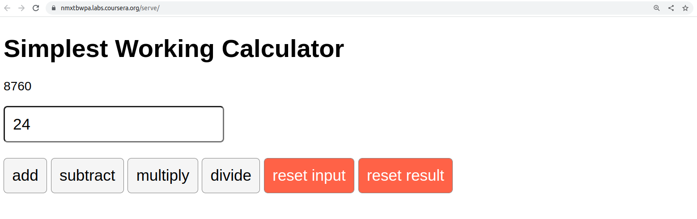

# About this graded assessment: Calculator app
## The purpose of this graded assessment
The primary purpose of a graded assessment is to check your knowledge and understanding of the key learning objectives of the course you have just completed. Most importantly, graded assessments help you establish which topics you have mastered and which require further focus before completing the course. Ultimately, the graded assessment is designed to help you make sure that you can apply what you have learned. This assessment's learning objective is to allow you to create a React application or App.

## Prepare for this graded assessment
You will have already encountered exercises, knowledge checks, in-video questions and other assessments as you have progressed through the course. The 'styling a page' ungraded lab from Module 2 is the foundation for this assessment.

The graded assessment requires you to complete a calculator in React. You will be provided with code snippets, and your task is to use these, plus any of your code to complete the calculator that can perform the four basic mathematical operations: addition, subtraction, multiplication, and division.

It will also have a single input button, which will accept user input (any number) and a total starting with a zero.

Once a user types into the input field, they will then have to update the total by pressing any of the four math operation buttons:

- addition 

- subtraction 

- multiplication 

- division 

Here's a diagram of the completed calculator app:


Nothing in the graded assessment will be outside what you have covered already, so you should be well placed to succeed. 

## Review the graded assessment
You will review your page to assess whether it meets the requirements outlined in the self-review quiz.

Good luck!


# Task

For this assessment, you will be building a calculator in React. You are provided with code snippets, and your task is to use these, plus any of your code to complete a calculator app that can perform the four basic mathematical operations: addition, subtraction, multiplication, and division.

## Before you begin
If you execute the npm start command before changing any code in this task, you'll get the notification in the code lab's terminal that reads "webpack compiled successfully".

You are now ready to start working on your app. Follow the comments in the code! They are your instructions on what you need to do to make this app work. For example, once you've added the imports, you should be able to serve the app. If still needs work, but at least you'll have the app showing in the browser.

## Steps
In this assessment, your goal is to build a simple calculator app.


The app should be fully functional. However, since you do not have the App.css file in the root folder, you need to add it, with the following code:
```css
* {
    font-family: sans-serif;
  }
  input,
  button {
    font-size: 20px;
    padding: 10px;
    border-radius: 5px;
  }
  input {
    display: block;
    margin-bottom: 20px;
  }
  button {
    border: 1px solid gray;
    background: whitesmoke;
    margin-right: 5px;
  }
  button:nth-last-child(2),
  button:nth-last-child(1) {
    background: tomato;
    color: white;
  }
  
```

You'll also need to import the App.css file into App.js.

Here is the app's starting code:
```javascript
//app.js
import {
  useState,
  useRef
} from "react"; 
import "./App.css";

function App() { 
  const inputRef = useRef(null); 
  const resultRef = useRef(null); 
  const [result, setResult] = useState(0); 
 
  function plus(e) { 
    e.preventDefault(); 
    setResult((result) => result + Number(inputRef.current.value)); 
  }; 
 
  function minus(e) { 
  	// Add the code for the minus function 
  };
 
  function times(e) { 
    // Add the code for the plus function 
  }; 
 
  function divide(e) { 
    // Add the code for the divide function 
  };
 
  function resetInput(e) { 
    // Add the code for the resetInput function 
  }; 
 
  function resetResult(e) { 
  	// Add the code for the resetResult function 
  }; 
 
  return ( 
    <div className="App"> 
      <div> 
        <h1>Simplest Working Calculator</h1> 
      </div> 
      <form> 
        <p ref={resultRef}> 
          {/* add the value of the current total */} 
        </p> 
        <input
          pattern="[0-9]" 
          ref={inputRef} 
          type="number" 
          placeholder="Type a number" 
        /> 
        <button onClick={plus}>add</button> 
        {/* Add the subtract button */} 
        {/* Add the multiply button */} 
        {/* Add the divide button */} 
        {/* Add the resetInput button */} 
        {/* Add the resetResult button */} 
      </form> 
    </div> 
  ); 
} 
 
export default App; 

```

Your goal is to use this starting code and extend it with missing pieces to make the app behave as expected: a fully working simple calculator app.